# AutoForge Architecture Diagrams

> Reference document for full system rebuild. Covers every major process flow,
> configuration file, and data path in the system.

---

## Table of Contents

1. [System Overview](#1-system-overview)
2. [npm CLI Bootstrap & Environment Setup](#2-npm-cli-bootstrap--environment-setup)
3. [Server Startup & Request Routing](#3-server-startup--request-routing)
4. [Project Lifecycle](#4-project-lifecycle)
5. [Agent Session Context Hydration](#5-agent-session-context-hydration)
6. [Agent Session Loop](#6-agent-session-loop)
7. [Parallel Orchestrator](#7-parallel-orchestrator)
8. [Feature Management & MCP Server](#8-feature-management--mcp-server)
9. [Security Model & Command Validation](#9-security-model--command-validation)
10. [WebSocket Real-Time Communication](#10-websocket-real-time-communication)
11. [UI State Management](#11-ui-state-management)
12. [Chat Sessions (Spec / Assistant / Expand)](#12-chat-sessions-spec--assistant--expand)
13. [Scheduling System](#13-scheduling-system)
14. [Configuration File Map](#14-configuration-file-map)

---

## 1. System Overview

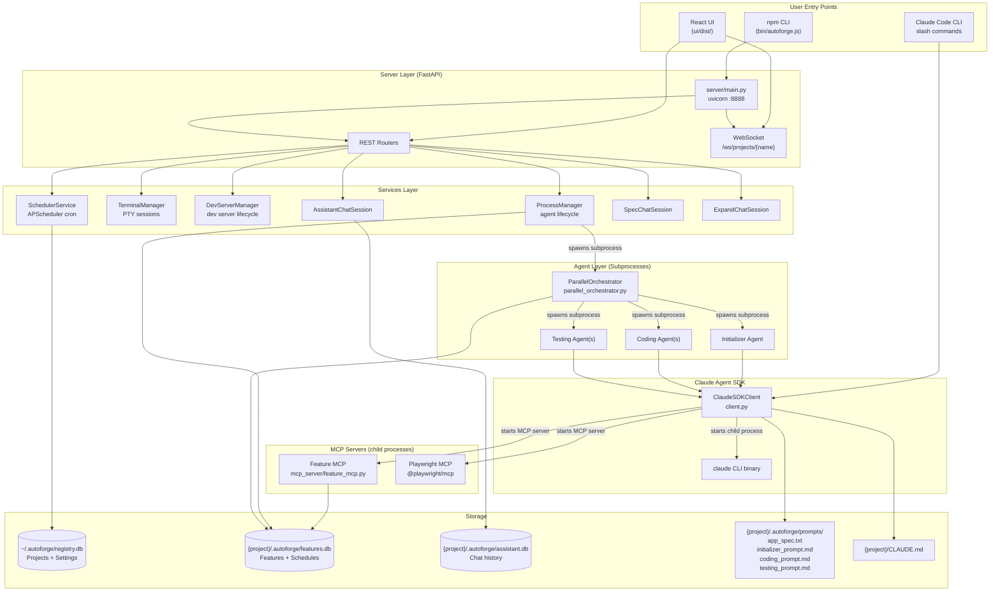

### Key Architectural Decisions

- **Two-agent pattern**: Initializer creates features from spec, Coding agents implement them
- **Subprocess isolation**: Each agent is a separate Python process with its own Claude CLI
- **MCP servers**: Feature database and Playwright browser are accessed via MCP protocol
- **Unified orchestrator**: Single orchestrator manages all agent types (init/coding/testing)

---

## 2. npm CLI Bootstrap & Environment Setup

**Files**: `bin/autoforge.js`, `lib/cli.js`, `requirements-prod.txt`

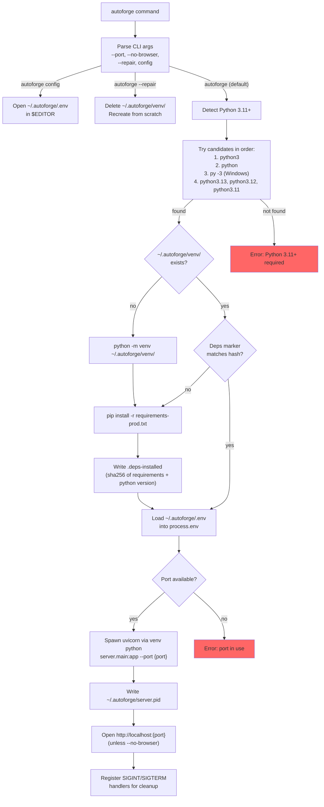

### Config Files Involved

| File | Location | Purpose |
|------|----------|---------|
| `.env` | `~/.autoforge/.env` | Environment variables (API keys, Vertex AI config, Playwright settings) |
| `.env.example` | Package root | Template copied on first run if .env doesn't exist |
| `requirements-prod.txt` | Package root | Runtime Python dependencies |
| `.deps-installed` | `~/.autoforge/venv/` | Composite marker: sha256(requirements) + Python version |
| `server.pid` | `~/.autoforge/` | PID of running server for cleanup |

---

## 3. Server Startup & Request Routing

**Files**: `server/main.py`, `server/routers/*.py`, `server/services/*.py`

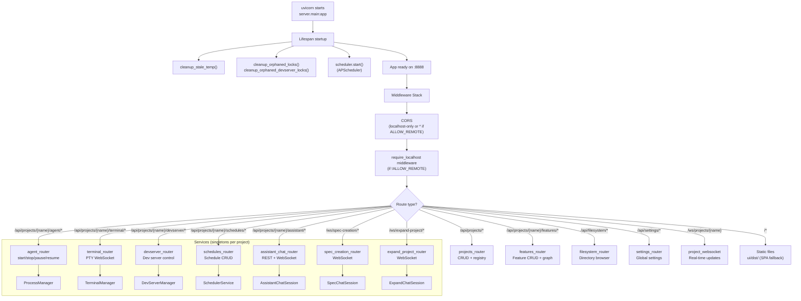

### REST API Endpoints Summary

| Router | Key Endpoints | Method |
|--------|--------------|--------|
| `projects` | `/api/projects`, `/api/projects/{name}` | GET, POST, DELETE |
| `features` | `/api/projects/{name}/features`, `/{id}`, `/graph`, `/bulk`, `/reorder` | GET, POST, PUT, DELETE |
| `agent` | `/api/projects/{name}/agent/start`, `/stop`, `/pause`, `/resume`, `/status` | POST, GET |
| `schedules` | `/api/projects/{name}/schedules`, `/{id}`, `/next-run` | GET, POST, PUT, DELETE |
| `devserver` | `/api/projects/{name}/devserver/start`, `/stop`, `/status`, `/config` | POST, GET, PUT |
| `terminal` | `/ws/projects/{name}/terminal/{id}` | WebSocket |
| `assistant` | `/api/projects/{name}/assistant/conversations`, `/ws/.../{conv_id}` | GET, POST, WebSocket |
| `spec_creation` | `/ws/spec-creation/{name}` | WebSocket |
| `expand_project` | `/ws/expand-project/{name}` | WebSocket |
| `filesystem` | `/api/filesystem/list`, `/validate` | GET, POST |
| `settings` | `/api/settings`, `/api/settings/models`, `/api/settings/providers` | GET, PUT |

---

## 4. Project Lifecycle

**Files**: `registry.py`, `autoforge_paths.py`, `prompts.py`, `server/routers/projects.py`

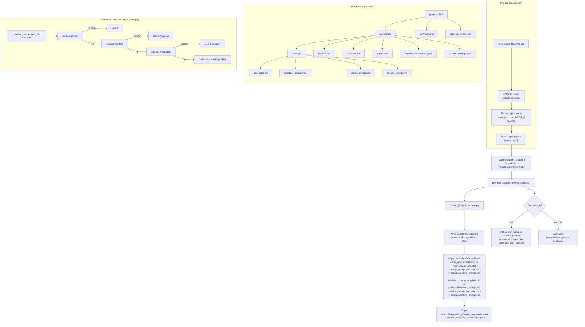

### Registry Database Schema (`~/.autoforge/registry.db`)

| Table | Columns | Purpose |
|-------|---------|---------|
| `projects` | `name (PK)`, `path`, `created_at`, `default_concurrency` | Project name-to-path mapping |
| `settings` | `key (PK)`, `value`, `updated_at` | Global key-value settings store |

---

## 5. Agent Session Context Hydration

This is the most critical flow - how each Claude agent session gets its context assembled.

**Files**: `client.py`, `prompts.py`, `security.py`, `registry.py`, `env_constants.py`

```mermaid
flowchart TD
    START["create_client(project_dir, model, yolo_mode, agent_id, agent_type)"]

    START --> TOOLS["Build allowed_tools list"]

    TOOLS --> BUILTIN["Built-in tools:<br/>Read, Write, Edit, Glob, Grep,<br/>Bash, WebFetch, WebSearch"]
    TOOLS --> FEAT_TOOLS{"Agent type?"}
    FEAT_TOOLS -->|initializer| INIT_T["feature_create_bulk, feature_create,<br/>feature_add_dependency,<br/>feature_set_dependencies,<br/>feature_get_stats"]
    FEAT_TOOLS -->|coding| CODE_T["feature_get_stats, feature_get_by_id,<br/>feature_get_summary, feature_claim_and_get,<br/>feature_mark_in_progress/passing/failing,<br/>feature_skip, feature_clear_in_progress"]
    FEAT_TOOLS -->|testing| TEST_T["feature_get_stats, feature_get_by_id,<br/>feature_get_summary,<br/>feature_mark_passing/failing"]

    TOOLS --> PW_CHECK{"YOLO mode?"}
    PW_CHECK -->|no| PW_TOOLS["+ Playwright tools:<br/>browser_navigate, browser_click,<br/>browser_take_screenshot,<br/>browser_type, browser_fill_form, etc."]
    PW_CHECK -->|yes| NO_PW["No Playwright tools"]

    START --> PERMS["Build permissions list"]
    PERMS --> FS_PERMS["Read(./**), Write(./**), Edit(./**),<br/>Glob(./**), Grep(./**), Bash(*)"]
    PERMS --> EXTRA_READ{"EXTRA_READ_PATHS<br/>env var set?"}
    EXTRA_READ -->|yes| VALIDATE_PATHS["Validate each path:<br/>- Must be absolute<br/>- Must exist as directory<br/>- Not in SENSITIVE_DIRECTORIES<br/>- Add Read/Glob/Grep permissions"]

    START --> SECURITY["Build security settings JSON"]
    SECURITY --> SANDBOX["sandbox: enabled=true"]
    SECURITY --> PERM_MODE["permissions: defaultMode=acceptEdits"]
    SECURITY --> WRITE_SETTINGS["Write to<br/>.autoforge/.claude_settings.json"]

    START --> MCP["Configure MCP servers"]
    MCP --> FEAT_MCP_CFG["features MCP:<br/>command: {sys.executable}<br/>args: [-m, mcp_server.feature_mcp]<br/>env: PROJECT_DIR={project_dir}"]
    MCP --> PW_MCP_CFG{"YOLO?"}
    PW_MCP_CFG -->|no| PW_CFG["playwright MCP:<br/>command: npx<br/>args: [@playwright/mcp@latest,<br/>--viewport-size 1280x720,<br/>--browser {firefox|chrome},<br/>--headless?, --isolated?]"]

    START --> SDK_ENV["Build SDK environment overrides"]
    SDK_ENV --> PROVIDER{"API provider?"}
    PROVIDER -->|claude| FWD_ENV["Forward env vars:<br/>ANTHROPIC_BASE_URL,<br/>ANTHROPIC_AUTH_TOKEN,<br/>ANTHROPIC_API_KEY, etc."]
    PROVIDER -->|glm/ollama/kimi/custom| ALT_ENV["Build from settings DB:<br/>ANTHROPIC_BASE_URL={base_url}<br/>auth token, model overrides"]
    PROVIDER -->|vertex| VERTEX_ENV["CLAUDE_CODE_USE_VERTEX=1<br/>CLOUD_ML_REGION, PROJECT_ID<br/>Convert model name (- to @)"]

    START --> HOOKS["Register SDK hooks"]
    HOOKS --> BASH_HOOK["PreToolUse[Bash]:<br/>bash_security_hook<br/>(validates commands against allowlist)"]
    HOOKS --> COMPACT_HOOK["PreCompact:<br/>pre_compact_hook<br/>(preserve workflow state,<br/>discard verbose content)"]

    START --> CREATE_SDK["Create ClaudeSDKClient"]
    CREATE_SDK --> SDK_OPTS["ClaudeAgentOptions:<br/>- model: {model}<br/>- system_prompt: 'expert full-stack developer...'<br/>- setting_sources: ['project']<br/>- max_buffer_size: 10MB<br/>- max_turns: 300 (coding) / 100 (testing)<br/>- cwd: {project_dir}<br/>- betas: ['context-1m-2025-08-07']<br/>- cli_path: system 'claude' binary"]

    style START fill:#4af
```

### Prompt Loading Fallback Chain

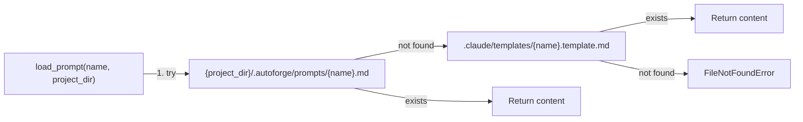

### Prompt Selection by Agent Type

```mermaid
flowchart TD
    AGENT_TYPE{"agent_type"}

    AGENT_TYPE -->|initializer| INIT_P["get_initializer_prompt(project_dir)<br/>loads: initializer_prompt.md"]
    AGENT_TYPE -->|testing| TEST_P["get_testing_prompt(project_dir, feature_ids)<br/>loads: testing_prompt.md<br/>replaces {{TESTING_FEATURE_IDS}}"]
    AGENT_TYPE -->|coding + batch| BATCH_P["get_batch_feature_prompt(feature_ids)<br/>loads: coding_prompt.md<br/>prepends batch header with IDs"]
    AGENT_TYPE -->|coding + single| SINGLE_P["get_single_feature_prompt(feature_id)<br/>loads: coding_prompt.md<br/>prepends feature assignment header"]
    AGENT_TYPE -->|coding (legacy)| CODE_P["get_coding_prompt(project_dir)<br/>loads: coding_prompt.md"]

    CODE_P --> YOLO{"YOLO mode?"}
    BATCH_P --> YOLO
    SINGLE_P --> YOLO
    YOLO -->|yes| STRIP["_strip_browser_testing_sections()<br/>Replace Step 5 with YOLO guidance<br/>Remove Playwright references"]
```

---

## 6. Agent Session Loop

**Files**: `agent.py`, `autonomous_agent_demo.py`

```mermaid
flowchart TD
    ENTRY["autonomous_agent_demo.py<br/>main()"]

    ENTRY --> LOAD_ENV["load_dotenv()"]
    LOAD_ENV --> SDK_OVERRIDES["get_effective_sdk_env()<br/>Apply UI provider settings<br/>to os.environ (setdefault)"]
    SDK_OVERRIDES --> RESOLVE_DIR["Resolve project_dir:<br/>1. Absolute path -> use directly<br/>2. Name -> registry lookup"]
    RESOLVE_DIR --> MIGRATE["migrate_project_layout()<br/>(legacy -> .autoforge/)"]

    MIGRATE --> MODE{"--agent-type set?"}

    MODE -->|yes (subprocess)| SUBPROCESS["asyncio.run(run_autonomous_agent(<br/>agent_type=args.agent_type,<br/>max_iterations=1))"]

    MODE -->|no (entry point)| ORCHESTRATOR["Clean temp files<br/>run_parallel_orchestrator(<br/>concurrency, model, yolo, etc.)"]

    subgraph "run_autonomous_agent() Loop"
        RA_START["Determine agent type<br/>(auto-detect if not set)"]
        RA_START --> RA_INIT{"Is initializer?"}
        RA_INIT -->|yes| COPY_SPEC["copy_spec_to_project()"]
        RA_INIT -->|no| CHECK_DONE{"All features passing?"}
        CHECK_DONE -->|yes| EXIT_DONE["EXIT: All complete"]

        COPY_SPEC --> LOOP_START
        CHECK_DONE -->|no| LOOP_START

        LOOP_START["iteration++"] --> CREATE_CLIENT["create_client(<br/>project_dir, model,<br/>yolo_mode, agent_id, agent_type)"]
        CREATE_CLIENT --> CHOOSE_PROMPT["Choose prompt<br/>(based on agent_type + feature assignment)"]
        CHOOSE_PROMPT --> RUN_SESSION["async with client:<br/>  run_agent_session(client, prompt)"]

        RUN_SESSION --> STATUS{"status?"}
        STATUS -->|continue| CHECK_RATE{"Rate limit<br/>in response?"}
        CHECK_RATE -->|no| CHECK_COMPLETE{"All features<br/>passing?"}
        CHECK_RATE -->|yes| BACKOFF_RL["Calculate backoff<br/>(parse retry-after or exponential)"]
        CHECK_COMPLETE -->|yes| EXIT_DONE2["EXIT: Complete"]
        CHECK_COMPLETE -->|no| SINGLE_CHECK{"Single feature<br/>or batch?"}
        SINGLE_CHECK -->|yes| EXIT_SINGLE["EXIT: Session done"]
        SINGLE_CHECK -->|no| SLEEP_CONTINUE["Sleep 3s -> next iteration"]
        BACKOFF_RL --> SLEEP_RL["Sleep {delay}s"]
        SLEEP_RL --> LOOP_START

        STATUS -->|rate_limit| BACKOFF_EXPLICIT["Parse retry-after<br/>or exponential backoff"]
        BACKOFF_EXPLICIT --> SLEEP_EXPLICIT["Sleep {delay}s"]
        SLEEP_EXPLICIT --> LOOP_START

        STATUS -->|error| ERROR_BACKOFF["Linear backoff<br/>capped at 5min"]
        ERROR_BACKOFF --> LOOP_START

        SLEEP_CONTINUE --> LOOP_START
    end

    subgraph "run_agent_session()"
        SES_START["client.query(message)"]
        SES_START --> STREAM["async for msg in client.receive_response()"]
        STREAM --> MSG_TYPE{"Message type?"}
        MSG_TYPE -->|AssistantMessage| TEXT_OR_TOOL{"Content block?"}
        TEXT_OR_TOOL -->|TextBlock| PRINT_TEXT["Print text"]
        TEXT_OR_TOOL -->|ToolUseBlock| PRINT_TOOL["Print [Tool: name]"]
        MSG_TYPE -->|UserMessage| TOOL_RESULT["Print tool result<br/>(truncated, security check)"]
        STREAM --> RETURN["Return (status, response_text)"]
    end
```

---

## 7. Parallel Orchestrator

**Files**: `parallel_orchestrator.py`

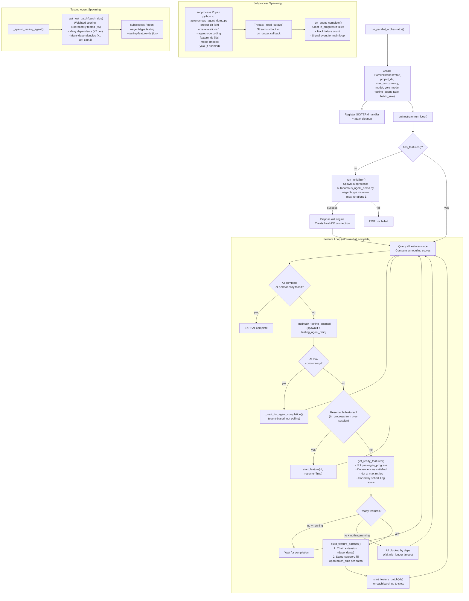

### Process Limits

| Constant | Value | Purpose |
|----------|-------|---------|
| `MAX_PARALLEL_AGENTS` | 5 | Max concurrent coding agents |
| `MAX_TOTAL_AGENTS` | 10 | Hard limit: coding + testing |
| `MAX_FEATURE_RETRIES` | 3 | Max retries before giving up on a feature |
| `POLL_INTERVAL` | 5s | Check interval for ready features |
| `INITIALIZER_TIMEOUT` | 1800s (30min) | Timeout for initializer agent |

---

## 8. Feature Management & MCP Server

**Files**: `mcp_server/feature_mcp.py`, `api/database.py`, `api/dependency_resolver.py`

```mermaid
flowchart TD
    subgraph "Feature States"
        PENDING["Pending<br/>passes=false<br/>in_progress=false"]
        IN_PROG["In Progress<br/>passes=false<br/>in_progress=true"]
        PASSING["Passing<br/>passes=true<br/>in_progress=false"]
        FAILING["Failing<br/>(marked by testing agent)<br/>passes=false<br/>in_progress=false"]

        PENDING -->|"feature_claim_and_get<br/>or feature_mark_in_progress"| IN_PROG
        IN_PROG -->|"feature_mark_passing"| PASSING
        IN_PROG -->|"feature_mark_failing<br/>or agent crash"| FAILING
        IN_PROG -->|"feature_skip"| PENDING
        PASSING -->|"feature_mark_failing<br/>(regression detected)"| FAILING
        FAILING -->|"re-claimed by orchestrator"| IN_PROG
    end

    subgraph "MCP Tools by Agent Type"
        direction TB
        INIT_TOOLS["Initializer Tools:<br/>feature_create_bulk<br/>feature_create<br/>feature_add_dependency<br/>feature_set_dependencies<br/>feature_get_stats"]
        CODE_TOOLS["Coding Tools:<br/>feature_claim_and_get (atomic)<br/>feature_mark_in_progress<br/>feature_mark_passing<br/>feature_mark_failing<br/>feature_skip<br/>feature_clear_in_progress<br/>feature_get_stats/by_id/summary"]
        TEST_TOOLS["Testing Tools:<br/>feature_mark_passing<br/>feature_mark_failing<br/>feature_get_stats/by_id/summary"]
    end

    subgraph "Database Schema (features.db)"
        FEAT_TABLE["features table:<br/>id (PK), priority, category,<br/>name, description, steps (JSON),<br/>passes (bool), in_progress (bool),<br/>dependencies (JSON array of IDs)"]
        SCHED_TABLE["schedules table:<br/>id (PK), project_name,<br/>start_time, duration_minutes,<br/>days_of_week (bitfield),<br/>enabled, yolo_mode, model,<br/>max_concurrency, crash_count"]
        OVERRIDE_TABLE["schedule_overrides table:<br/>id (PK), schedule_id (FK),<br/>override_type, expires_at"]
    end

    subgraph "Dependency Resolution"
        DEP_CHECK["are_dependencies_satisfied(feature, all_features)"]
        DEP_CHECK --> CHECK_EACH["For each dependency ID:<br/>Is that feature passing?"]
        DEP_CYCLE["would_create_circular_dependency()"]
        DEP_CYCLE --> DFS["DFS cycle detection"]
        SCHEDULING["compute_scheduling_scores()"]
        SCHEDULING --> TOPO["Reverse topological sort<br/>+ BFS layer scoring"]
    end
```

### feature_claim_and_get (Atomic Claim)

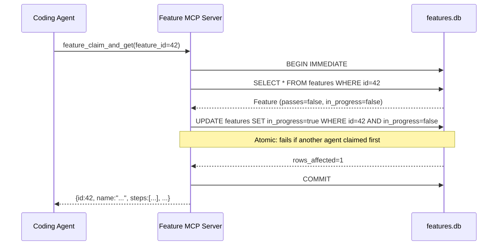

---

## 9. Security Model & Command Validation

**Files**: `security.py`, `client.py`

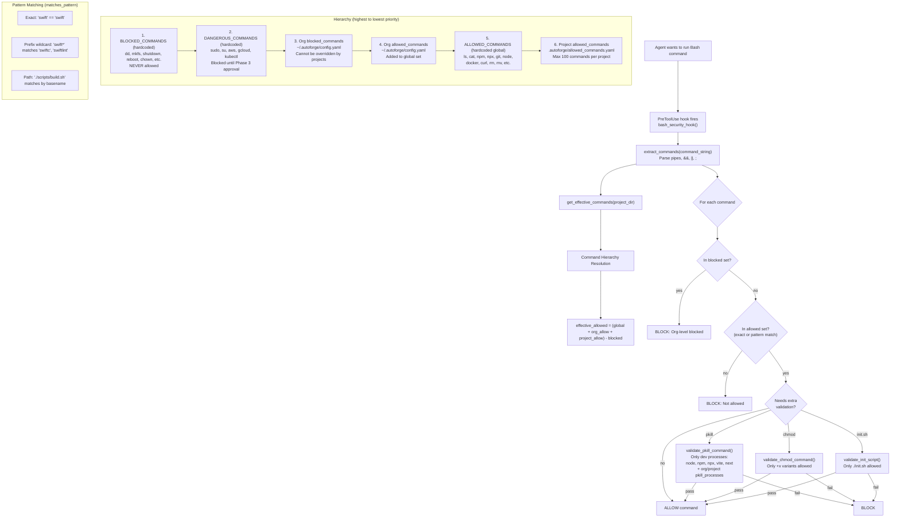

### Filesystem Security Layers

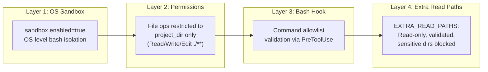

---

## 10. WebSocket Real-Time Communication

**Files**: `server/websocket.py`

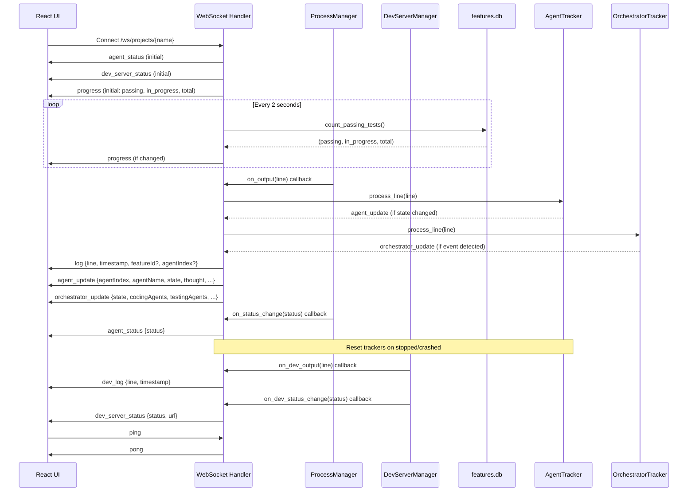

### WebSocket Message Types

| Type | Direction | Payload | Purpose |
|------|-----------|---------|---------|
| `progress` | Server -> Client | `{passing, in_progress, total, percentage}` | Feature completion stats |
| `agent_status` | Server -> Client | `{status: stopped\|running\|paused\|crashed}` | Agent lifecycle |
| `log` | Server -> Client | `{line, timestamp, featureId?, agentIndex?}` | Agent stdout |
| `agent_update` | Server -> Client | `{agentIndex, agentName, agentType, featureId, state, thought}` | Per-agent state (Mission Control) |
| `orchestrator_update` | Server -> Client | `{state, codingAgents, testingAgents, readyCount, message}` | Orchestrator decisions |
| `dev_log` | Server -> Client | `{line, timestamp}` | Dev server stdout |
| `dev_server_status` | Server -> Client | `{status, url}` | Dev server lifecycle |
| `ping`/`pong` | Bidirectional | `{}` | Keep-alive |

### Agent State Detection (from stdout parsing)

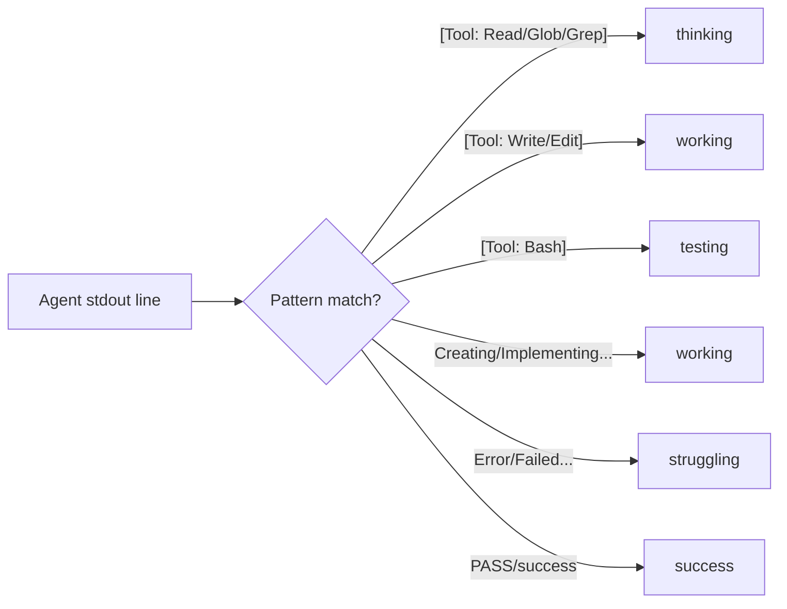

---

## 11. UI State Management

**Files**: `ui/src/App.tsx`, `ui/src/hooks/useWebSocket.ts`, `ui/src/hooks/useProjects.ts`, `ui/src/lib/api.ts`

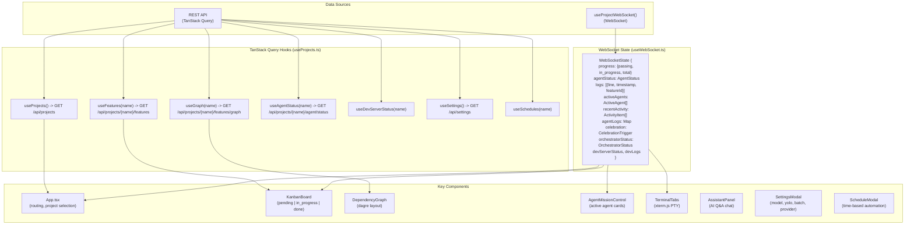

### React App URL Routes

| Route | Component | Purpose |
|-------|-----------|---------|
| `/` | `App` (default) | Project selection + main dashboard |
| `/#/docs` | `DocsPage` | In-app documentation |
| `/#/docs/:section` | `DocsContent` | Specific doc section |

---

## 12. Chat Sessions (Spec / Assistant / Expand)

**Files**: `server/services/spec_chat_session.py`, `server/services/assistant_chat_session.py`, `server/services/expand_chat_session.py`

```mermaid
flowchart TD
    subgraph "Spec Creation (/ws/spec-creation/{name})"
        SPEC_WS["WebSocket connection"]
        SPEC_WS --> SPEC_SESSION["SpecChatSession<br/>Uses Claude Agent SDK"]
        SPEC_SESSION --> SPEC_TOOLS["Tools: question (structured Q&A),<br/>write_file (generate spec)"]
        SPEC_SESSION --> SPEC_OUTPUT["Outputs:<br/>- text (streaming)<br/>- question (multi-select)<br/>- file_written<br/>- spec_complete"]
        SPEC_OUTPUT --> SPEC_FILE[".autoforge/prompts/app_spec.txt"]
    end

    subgraph "Assistant Chat (/api/projects/{name}/assistant)"
        ASST_REST["REST: list/create conversations"]
        ASST_WS["WebSocket: stream messages"]
        ASST_REST --> ASST_DB["assistant.db<br/>(conversations + messages)"]
        ASST_WS --> ASST_SESSION["AssistantChatSession<br/>Read-only Claude session"]
        ASST_SESSION --> ASST_TOOLS["Tools: Read, Glob, Grep<br/>(no Write/Edit - read-only)"]
        ASST_SESSION --> ASST_CONTEXT["Context: project files,<br/>feature list, CLAUDE.md"]
    end

    subgraph "Expand Project (/ws/expand-project/{name})"
        EXP_WS["WebSocket connection"]
        EXP_WS --> EXP_SESSION["ExpandChatSession<br/>Uses Claude Agent SDK"]
        EXP_SESSION --> EXP_TOOLS["Tools: Read, Glob, Grep,<br/>feature_create, feature_add_dependency"]
        EXP_SESSION --> EXP_OUTPUT["Outputs:<br/>- text (streaming)<br/>- features_created<br/>- expansion_complete"]
    end
```

### Chat Session Context Hydration

Each chat session type creates its own `ClaudeSDKClient` with:

| Setting | Spec Creation | Assistant | Expand |
|---------|---------------|-----------|--------|
| **Tools** | Custom (question, write_file) | Read, Glob, Grep only | Read, Glob, Grep + Feature MCP |
| **Permissions** | Read/Write project | Read-only project | Read project + Feature MCP |
| **System Prompt** | "Expert product manager..." | "Expert assistant..." | "Expert product manager..." |
| **max_turns** | 100 | 50 | 100 |
| **MCP Servers** | None | None | Feature MCP |
| **Settings file** | Ephemeral (.expand.{uuid}.json) | .claude_assistant_settings.json | Ephemeral (.expand.{uuid}.json) |

---

## 13. Scheduling System

**Files**: `server/services/scheduler_service.py`, `server/routers/schedules.py`, `api/database.py`

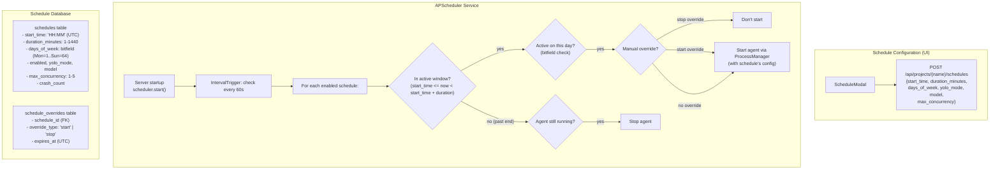

---

## 14. Configuration File Map

Complete reference of every config/state file and what reads/writes it.

### Global Files (`~/.autoforge/`)

| File | Format | Written By | Read By | Purpose |
|------|--------|-----------|---------|---------|
| `registry.db` | SQLite | `registry.py`, Server API | All components | Project name-to-path mapping + global settings |
| `.env` | dotenv | User (manual) | `lib/cli.js`, `dotenv.load_dotenv()` | API keys, Vertex AI config, Playwright settings |
| `config.yaml` | YAML | User (manual) | `security.py` | Org-level allowed/blocked commands, pkill processes |
| `venv/` | Directory | `lib/cli.js` | `lib/cli.js` | Python virtual environment |
| `venv/.deps-installed` | Text | `lib/cli.js` | `lib/cli.js` | Dependency hash marker |
| `server.pid` | Text | `lib/cli.js` | `lib/cli.js` | Running server PID |

### Per-Project Files (`{project}/.autoforge/`)

| File | Format | Written By | Read By | Purpose |
|------|--------|-----------|---------|---------|
| `prompts/app_spec.txt` | XML text | Spec creation chat / user | Initializer agent (via copy to root) | Application specification |
| `prompts/initializer_prompt.md` | Markdown | Template copy / user | `prompts.py` | Instructions for initializer agent |
| `prompts/coding_prompt.md` | Markdown | Template copy / user | `prompts.py` | Instructions for coding agents |
| `prompts/testing_prompt.md` | Markdown | Template copy / user | `prompts.py` | Instructions for testing agents |
| `features.db` | SQLite | Feature MCP server, orchestrator | MCP server, orchestrator, server API, progress.py | Feature state, schedules |
| `assistant.db` | SQLite | AssistantChatSession | AssistantChatSession | Chat conversation history |
| `.agent.lock` | Text (PID:createtime) | ProcessManager | ProcessManager | Prevent multiple agent instances |
| `.devserver.lock` | Text | DevServerManager | DevServerManager | Prevent multiple dev servers |
| `.claude_settings.json` | JSON | `client.py` | Claude CLI | Sandbox + permission config |
| `.claude_assistant_settings.json` | JSON | AssistantChatSession | Claude CLI | Assistant chat permissions |
| `.claude_settings.expand.{uuid}.json` | JSON | ExpandChatSession | Claude CLI | Ephemeral expand session config |
| `allowed_commands.yaml` | YAML | Template copy / user | `security.py` | Project-specific bash command allowlist |
| `.gitignore` | Text | `autoforge_paths.py` | Git | Ignore runtime files |
| `.progress_cache` | JSON | `progress.py` | `progress.py` | Webhook deduplication |

### Project Root Files

| File | Format | Written By | Read By | Purpose |
|------|--------|-----------|---------|---------|
| `CLAUDE.md` | Markdown | User | Claude CLI (setting_sources=['project']) | Project-level Claude instructions |
| `app_spec.txt` | XML text | `prompts.copy_spec_to_project()` | Initializer agent | Copy of spec for agent to read |

### Environment Variables

| Variable | Default | Used By | Purpose |
|----------|---------|---------|---------|
| `ANTHROPIC_BASE_URL` | (none) | `client.py`, `registry.py` | Custom API endpoint |
| `ANTHROPIC_AUTH_TOKEN` | (none) | `client.py` | API auth token (GLM, Custom) |
| `ANTHROPIC_API_KEY` | (none) | `client.py` | API key (Kimi) |
| `ANTHROPIC_DEFAULT_OPUS_MODEL` | (none) | `registry.py` | Override default model |
| `CLAUDE_CODE_USE_VERTEX` | (none) | `client.py` | Enable Vertex AI ("1") |
| `CLOUD_ML_REGION` | (none) | `client.py` | GCP region for Vertex |
| `ANTHROPIC_VERTEX_PROJECT_ID` | (none) | `client.py` | GCP project for Vertex |
| `EXTRA_READ_PATHS` | (none) | `client.py` | Comma-separated read-only paths |
| `PLAYWRIGHT_HEADLESS` | `true` | `client.py` | Browser visibility |
| `PLAYWRIGHT_BROWSER` | `firefox` | `client.py` | Browser choice |
| `PROGRESS_N8N_WEBHOOK_URL` | (none) | `progress.py` | Webhook for progress notifications |
| `AUTOFORGE_ALLOW_REMOTE` | (none) | `server/main.py` | Allow non-localhost connections |

---

## Process Interaction Summary

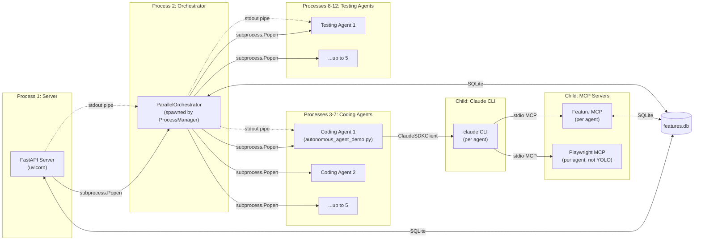

### Total Process Count (worst case)

| Component | Count | Notes |
|-----------|-------|-------|
| Server (uvicorn) | 1 | Always running |
| Orchestrator | 1 | Spawned per project |
| Coding agents | 1-5 | `--concurrency` flag |
| Testing agents | 0-5 | `testing_agent_ratio` x coding count, capped |
| Claude CLI | 1 per agent | Child of each agent |
| Feature MCP | 1 per agent | Child of Claude CLI |
| Playwright MCP | 0-1 per agent | Not in YOLO mode |
| **Max total** | **~23** | 1 server + 1 orch + 5 coding + 5 testing + 11 CLIs |
